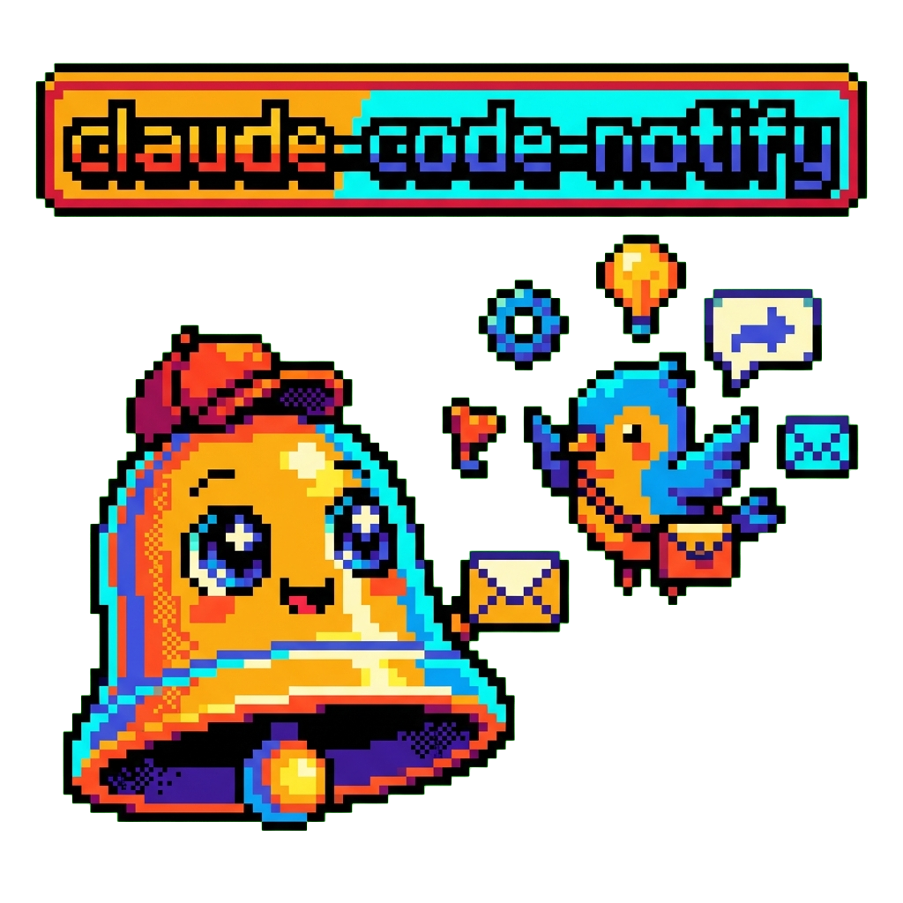

<div align="center">
  

  # claudepong

  [](https://github.com/tsilva/claudepong)
  [](https://www.apple.com/macos/sequoia/)
  [](LICENSE)
  [](https://github.com/nikitabobko/AeroSpace)

  **🏓 Claude pings, you pong back — desktop notifications that focus the right window, even across workspaces 🔔**

  [Installation](#-installation) · [Usage](#-usage) · [How It Works](#-how-it-works) · [Troubleshooting](#-troubleshooting)
</div>

---

## Overview

**The Pain:** You're running Claude Code in the background while working on something else. You keep switching tabs to check if it's done. Or worse — you miss when it needs permission and it sits idle for minutes.

**The Solution:** claudepong sends macOS desktop notifications the instant Claude finishes a task or needs permission. One click jumps you directly to the right IDE window — even if it's buried in another workspace.

**The Result:** Zero tab-switching. Zero missed prompts. Stay in flow while Claude works.

<div align="center">

| ⚡ Setup | 🎯 Focus | 🖥️ Workspaces |
|---------|----------|---------------|
| 30 seconds | 1-click | Cross-workspace |

</div>

## ✨ Features

- **🔔 Smart notifications** — Alerts when Claude finishes tasks ("Ready for input") or needs permission ("Permission required")
- **🎯 Cross-workspace window focus** — Click notification to jump directly to the right Cursor/VS Code window via AeroSpace
- **🍎 Works on Sequoia** — Uses AeroSpace instead of broken AppleScript/Hammerspoon APIs
- **⚙️ Zero config** — Install script handles everything automatically

## 📋 Requirements

- **macOS** (Sequoia 15.x supported)
- **Homebrew** for installing dependencies
- **Cursor** or **VS Code** with Claude Code extension
- **[aerospace-setup](https://github.com/tsilva/aerospace-setup)** — Required for window focusing

## 🚀 Installation

### Step 1: Install aerospace-setup (required)

```bash
git clone https://github.com/tsilva/aerospace-setup.git
cd aerospace-setup
./install.sh
```

This installs AeroSpace configuration and creates the `~/.claude/focus-window.sh` symlink needed for click-to-focus.

### Step 2: Install claudepong

```bash
git clone https://github.com/tsilva/claudepong.git
cd claudepong
./install.sh
```

The installer will:
1. Verify aerospace-setup is installed
2. Install `terminal-notifier` via Homebrew
3. Copy notification script to `~/.claude/`
4. Configure Claude Code hooks in `~/.claude/settings.json`

### Post-install

1. Ensure AeroSpace is running (should start automatically)
2. Grant Accessibility permissions when prompted
3. Restart your terminal/IDE

## 💡 Usage

### Cursor / VS Code

Notifications work automatically after installation. Start a new Claude Code session and you'll receive notifications when:
- Claude finishes a task and is ready for input
- Claude needs permission to proceed

Click the notification to focus the IDE window.

### iTerm2

Claude Code hooks don't fire in standalone terminals. Set up iTerm Triggers instead:

1. Open **iTerm → Settings → Profiles → Advanced → Triggers → Edit**
2. Add a new trigger:
   - **Regex:** `^[[:space:]]*>`
   - **Action:** Run Command...
   - **Parameters:** `~/.claude/notify.sh "Ready for input"`
   - **Instant:** ✓ (checked)

## 🔧 How It Works

```
┌─────────────────┐     ┌──────────────────┐     ┌─────────────────┐
│  Claude Code    │────▶│    notify.sh     │────▶│ terminal-notifier│
│  Stop Hook      │     │                  │     │                 │
└─────────────────┘     └──────────────────┘     └────────┬────────┘
                                                          │
                                                          ▼ click
                        ┌──────────────────┐     ┌─────────────────┐
                        │   AeroSpace      │◀────│ focus-window.sh │
                        │  (focus window)  │     │    (symlink)    │
                        └──────────────────┘     └─────────────────┘
```

1. Claude Code's `Stop` or `PermissionRequest` hook triggers `notify.sh`
2. `notify.sh` sends a notification via `terminal-notifier`
3. Clicking the notification executes `~/.claude/focus-window.sh` (symlink to aerospace-setup)
4. The aerospace script finds and focuses the correct IDE window

### Why AeroSpace?

macOS Sequoia 15.x broke traditional window management APIs:

| Approach | Problem |
|----------|---------|
| Hammerspoon `hs.spaces.gotoSpace()` | No longer works on Sequoia |
| AppleScript `AXRaise` | Can't switch between Spaces |
| URL schemes (`cursor://`, `vscode://`) | Don't switch workspaces |
| **AeroSpace** | ✅ Works reliably without disabling SIP |

AeroSpace uses its own virtual workspace abstraction that bypasses these limitations.

## 🐳 claude-sandbox Integration

If you run Claude Code inside [claude-sandbox](https://github.com/tsilva/claude-sandbox), notifications can still reach your macOS desktop via TCP.

During installation, select "yes" when asked about sandbox support. This installs:
- A launchd service that listens on `localhost:19223`
- A container-compatible notify script that connects via `host.docker.internal`
- Hooks configured in `~/.claude-sandbox/claude-config/settings.json`

**Requirements:**
- claude-sandbox must have `netcat-openbsd` in its Dockerfile (included in recent versions)

**How it works:**
```
Container                              Host (macOS)
────────────────────────────────────────────────────────────
Claude Code hook fires
       │
       ▼
notify.sh connects via ─────────────►  launchd TCP listener
host.docker.internal:19223                    │
                                              ▼
                                       terminal-notifier
                                       + focus-window.sh
```

## 🗑️ Uninstallation

```bash
./uninstall.sh
```

This removes the notification scripts, hooks, and sandbox support (if installed). AeroSpace and terminal-notifier are kept (you may have other uses for them).

To fully remove dependencies:
```bash
# Remove terminal-notifier
brew uninstall terminal-notifier

# Remove aerospace-setup (if desired)
cd ../aerospace-setup
./uninstall.sh
```

## 🔍 Troubleshooting

### Notifications don't appear

1. Check that `terminal-notifier` is installed: `which terminal-notifier`
2. Verify the hook is configured: `cat ~/.claude/settings.json | grep Stop`
3. Test manually: `~/.claude/notify.sh "Test"`

### Window doesn't focus on click

1. Verify aerospace-setup is installed: `ls -la ~/.claude/focus-window.sh`
2. Check AeroSpace is running: `pgrep -x AeroSpace`
3. Check Accessibility permissions: **System Settings → Privacy & Security → Accessibility**
4. Test window listing: `aerospace list-windows --all | grep Cursor`

### Installer fails with "aerospace-setup is required"

Install aerospace-setup first:
```bash
git clone https://github.com/tsilva/aerospace-setup.git
cd aerospace-setup
./install.sh
```

### Notifications work but hooks don't fire

Claude Code hooks only work in IDE-integrated terminals (Cursor/VS Code). For standalone terminals like iTerm2, use the Triggers workaround described above.

## 🤝 Contributing

Contributions welcome! Feel free to [open an issue](https://github.com/tsilva/claudepong/issues) or submit a pull request.

## 📄 License

[MIT](LICENSE)

---

<div align="center">

Found this useful? [⭐ Star the repo](https://github.com/tsilva/claudepong) to help others discover it!

</div>
